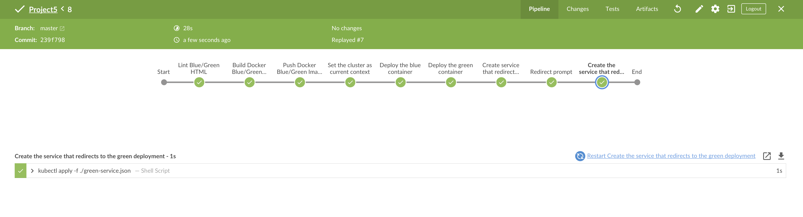

# Cloud DevOps Capstone Project
_____

This is the final project of [Udacity's Cloud Dev Ops Engineer Nanodegree](https://www.udacity.com/course/cloud-dev-ops-nanodegree--nd9991).

The project allowed me to apply the skills and knowledge I have developed throughout this Nanodegree program. Which includes the following: 

* :star: Working in AWS
* :star: Using Jenkins to implement Continuous Integration and Continuous Deployment 
* :star: Building pipelines 
* :star: Working with Ansible and CloudFormation to deploy clusters
* :star: Building Kubernetes clusters
* :star: Building Docker containers in pipelines

I chose to develop a *CI/CD* pipeline with **blue/green** deployment. 

I configured my *Continuous Integration* steps using my **Jenkinsfile**. It includes *typographical checking* 

Once the *Continuous Integration* is completed the *Continuous Deployment* takes over the following steps:

* Pushing the built Docker container(s) to the Docker repository
* Deploying the docker containers to a small *Kubernetes cluster* 

Please see screenshots folder for more images

### Resources
____

* Udacity Forums
* [AWS Blue/Green Deployment Guide](https://aws-quickstart.s3.amazonaws.com/quickstart-codepipeline-bluegreen-deployment/doc/blue-green-deployments-to-aws-elastic-beanstalk-on-the-aws-cloud.pdf)
* [How to Install and Use Docker on Ubuntu 18.04](https://www.digitalocean.com/community/tutorials/how-to-install-and-use-docker-on-ubuntu-18-04)
* [Medium Post Cloud DevOps FAQs](https://medium.com/@andresaaap/capstone-cloud-devops-nanodegree-4493ab439d48)

